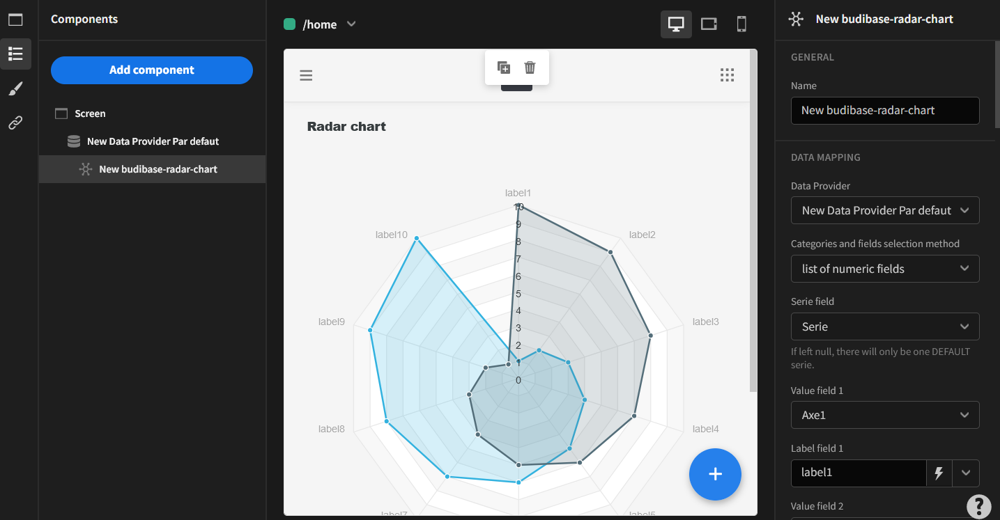

# Budibase-radar-chart

## Description
Budibase Radar Chart Component. 
It allows you to add a radar to your budibase application. It must be inserted inside a data provider.



Find out more about [Budibase](https://github.com/Budibase/budibase).

## Instructions

To develop, best is to run
```
budi plugins --dev
```


To build your new  plugin run the following in your Budibase CLI:
```
budi plugins --build
```

You can also re-build everytime you make a change to your plugin with the command:
```
budi plugins --watch
```

In the folder of the plugin
```
yarn watch 
```

To build a plugin, you must fill-in schema.json. 
Available icons are spectrum ones. You may visit the list of all icons at https://spectrum.adobe.com/page/icons/.

